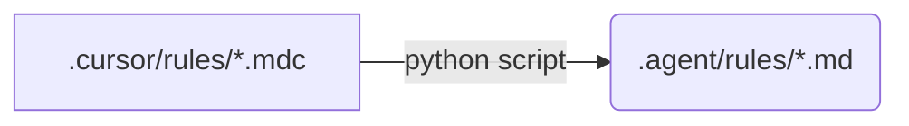

[](https://github.com/Common-ka/ai-agent-unity-rules/releases)

# Unity AI Agent Rules (Cursor + Antigravity)

## 📋 Description

**The Single Source of Truth for Unity AI assistance.**

This repository provides production-ready configuration rules for Unity 6.2+ projects. It is designed to be **universal**, automatically supporting both:
1.  **Cursor IDE** (via native `.mdc` format)
2.  **Google Antigravity** (via synced `.agent/rules` format)

We use a "write once, deploy everywhere" approach: rules are defined in Cursor's format and automatically converted for Antigravity Workspace using a custom CI/CD workflow.

## 🚀 Quick Start

### Requirements

- Unity 6.2 or higher
- **IDE:** Cursor IDE *OR* Google Antigravity Workspace
- .NET SDK for C# development

### Installation

#### Option A: Automatic Setup (Recommended)
Simply clone this repository into the root of your Unity project. The AI agents will automatically detect their respective configuration folders.

```bash
cd YourUnityProject
git clone [https://github.com/Common-ka/ai-agent-unity-rules.git](https://github.com/Common-ka/ai-agent-unity-rules.git) .

```

#### Option B: Manual Setup

**For Cursor Users:**

1. Copy the `.cursor/` folder to your project root.
2. Copy `.vscode/settings.json` to your project's `.vscode/` folder.

**For Antigravity Users:**

1. Copy the `.agent/` folder to your project root.
2. Ensure `.agent/rules/` contains the `.md` files.

---

## 🛠 How it Works (Sync Workflow)

This repository uses a **Uni-Directional Data Flow** to keep rules in sync.



1. **Source:** Rules are authored in `.cursor/rules/` using the modern `.mdc` format.
2. **Sync:** A Python script (`sync_rules.py`) automatically converts these files into standard Markdown for Antigravity.
3. **Automation:** A GitHub Action runs on every push to ensure `.agent/rules` are always up to date.


## 📄 License

MIT License - see [LICENSE](https://www.google.com/search?q=LICENSE)
